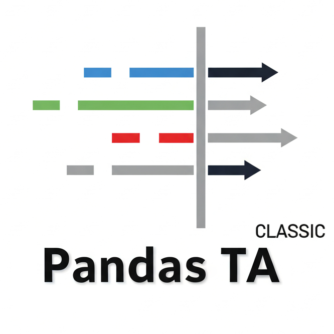

<p align="center">
  <a href="https://github.com/xgboosted/pandas-ta-classic">
    
  </a>
</p>

# Pandas TA Classic - Technical Analysis Library

[](#license)
[](https://github.com/xgboosted/pandas-ta-classic/actions)
[](https://xgboosted.github.io/pandas-ta-classic/)
[](https://pypi.org/project/pandas-ta-classic/)
[](https://pypi.org/project/pandas-ta-classic/)
[](https://pypi.org/project/pandas-ta-classic/)
[](https://pypistats.org/packages/pandas-ta-classic)
[](#stars)
[](#forks)
[](#usedby)
[](#contributors)


**Pandas TA Classic** is an easy-to-use library that leverages the Pandas package with **143 indicators and utility functions** and **62 TA Lib candlestick patterns** (**205 total**). Many commonly used indicators are included, such as: _Simple Moving Average_ (**sma**), _Moving Average Convergence Divergence_ (**macd**), _Hull Exponential Moving Average_ (**hma**), _Bollinger Bands_ (**bbands**), _On-Balance Volume_ (**obv**), _Aroon & Aroon Oscillator_ (**aroon**), _Squeeze_ (**squeeze**) and **many more**.

This is the **classic/community maintained version** of the popular pandas-ta library.

## 🚀 Quick Start

### Installation

**Stable Release**
```bash
pip install pandas-ta-classic
```

**Latest Version**
```bash
pip install -U git+https://github.com/xgboosted/pandas-ta-classic
```

### Basic Usage

```python
import pandas as pd
import pandas_ta_classic as ta

# Load your data
df = pd.read_csv("path/to/symbol.csv")
# OR if you have yfinance installed
df = df.ta.ticker("aapl")

# Calculate indicators
df.ta.sma(length=20, append=True)        # Simple Moving Average
df.ta.rsi(append=True)                   # Relative Strength Index  
df.ta.macd(append=True)                  # MACD
df.ta.bbands(append=True)                # Bollinger Bands

# Or run a strategy with multiple indicators
df.ta.strategy("CommonStrategy")         # Runs commonly used indicators
```

## 📊 Features

- **143 Technical Indicators & Utilities** across 9 categories (Candles, Momentum, Overlap, Trend, Volume, etc.)
- **62 TA Lib Candlestick Patterns** for comprehensive pattern recognition
- **205 Total Indicators & Patterns** - the most comprehensive Python TA library
- **Strategy System** with multiprocessing support for bulk indicator processing
- **Pandas DataFrame Extension** for seamless integration (`df.ta.indicator()`)
- **TA Lib Integration** - automatically uses TA Lib versions when available
- **Vectorbt Integration** - compatible with popular backtesting framework
- **Custom Indicators** - easily create and chain your own indicators

## 📚 Documentation

**Complete documentation is available at:** 🔗 **[https://xgboosted.github.io/pandas-ta-classic/](https://xgboosted.github.io/pandas-ta-classic/)**

### Quick Links
- 📖 [**Usage Guide**](https://xgboosted.github.io/pandas-ta-classic/usage.html) - Programming conventions and basic usage
- 🏗️ [**Strategy System**](https://xgboosted.github.io/pandas-ta-classic/strategies.html) - Multiprocessing and bulk indicator processing  
- 📊 [**Indicators Reference**](https://xgboosted.github.io/pandas-ta-classic/indicators.html) - Complete list of all 143 indicators & 62 patterns
- 🔧 [**DataFrame API**](https://xgboosted.github.io/pandas-ta-classic/dataframe_api.html) - Properties and methods reference
- 📈 [**Performance Metrics**](https://xgboosted.github.io/pandas-ta-classic/performance.html) - Backtesting and performance analysis
- 💡 [**Examples**](https://github.com/xgboosted/pandas-ta-classic/tree/main/examples) - Jupyter notebooks and code examples

## 🐍 Python Version Support

**Pandas TA Classic** supports Python **3.9 through 3.13** following a rolling support policy for the latest stable version plus 4 preceding minor versions.

**Note:** _TA Lib_ installation enables all candlestick patterns: `pip install TA-Lib`

## 🤝 Contributing

We welcome contributions! Please see our [contributing guidelines](https://github.com/xgboosted/pandas-ta-classic/blob/main/CONTRIBUTING.md) and [issues page](https://github.com/xgboosted/pandas-ta-classic/issues).

### Reporting Issues
- Check [existing issues](https://github.com/xgboosted/pandas-ta-classic/issues) first
- Provide reproducible code examples  
- Include relevant error messages and data samples

## 📋 Changelog

For detailed information about changes, improvements, and new features, please see the [CHANGELOG.md](CHANGELOG.md) file.

## 🔗 Sources

[Original TA-LIB](http://ta-lib.org/) | [TradingView](http://www.tradingview.com) | [Sierra Chart](https://search.sierrachart.com/?Query=indicators&submitted=true) | [MQL5](https://www.mql5.com) | [FM Labs](https://www.fmlabs.com/reference/default.htm) | [Pro Real Code](https://www.prorealcode.com/prorealtime-indicators) | [User 42](https://user42.tuxfamily.org/chart/manual/index.html)

## ❤️ Support

If you find this library helpful, please consider:

[](https://github.com/sponsors/xgboosted)

## 📄 License

This project is licensed under the MIT License - see the [LICENSE](LICENSE) file for details.